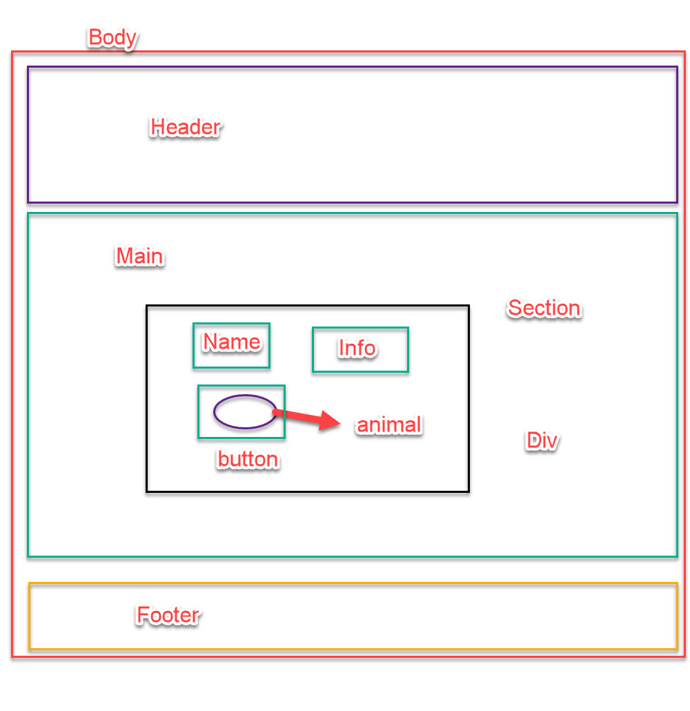

## The Golden Rule

🦸 🦸‍♂️ `Stop starting and start finishing.` 🏁

If you work on more than one feature at a time, you are guaranteed to multiply your bugs and your anxiety.

## Making a plan

1. **Make a drawing of your app. Simple "wireframes"**
1. **Once you have a drawing, name the HTML elements you'll need to realize your vision**
1. **For each HTML element ask: Why do I need this?**
1. **Once we know _why_ we need each element, think about how to implement the "Why" as a "How"**
1. **Find all the 'events' (user clicks, form submit, on load etc) in your app. Ask one by one, "What happens when" for each of these events. Does any state change?**
1. **Think about how to validate each of your features according to a Definition of Done**
1. **Consider what features _depend_ on what other features. Use this dependency logic to figure out what order to complete tasks.**

Additional considerations:

- Ask: which of your HTML elements need to be hard coded, and which need to be dynamically generated?
- Consider your data model.
  - What kinds of objects (i.e., Dogs, Friends, Todos, etc) will you need?
  - What are the key/value pairs?
  - What arrays might you need?
  - What needs to live in a persistence layer?
- Is there some state we need to initialize?
- Ask: should any of this work be abstracted into functions? (i.e., is the work complicated? can it be reused?)

## Plan

Draw Wireframe

Map out HTML elements to visualize

- html
- head
- body
- header
- h1
- main
- section
- h2
- p
- button
- animalDiv
- footer

## Rubric

| App should include . . .                                                            |  10 |
| :---------------------------------------------------------------------------------- | --: |
| Bio data shows on page, including name, pronouns, and where you live                |   1 |
| Favorite animal is hidden on page load                                              |   2 |
| Button with event listener shows favorite animal data                               |   2 |
| README file with plan                                                               |   2 |
| Repo has a commit history with multiple commits and commit messages that make sense |   1 |
| Link in About section of repo to deployed site in Netlify                           |   1 |
| Work is done on a dev branch and a PR link is submitted to Canvas                   |   1 |
